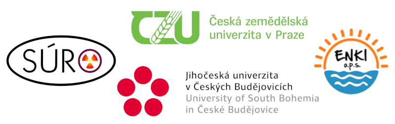
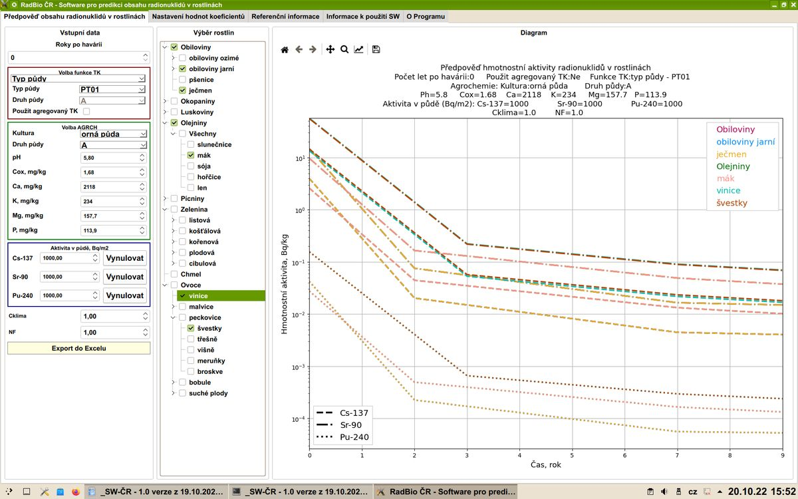
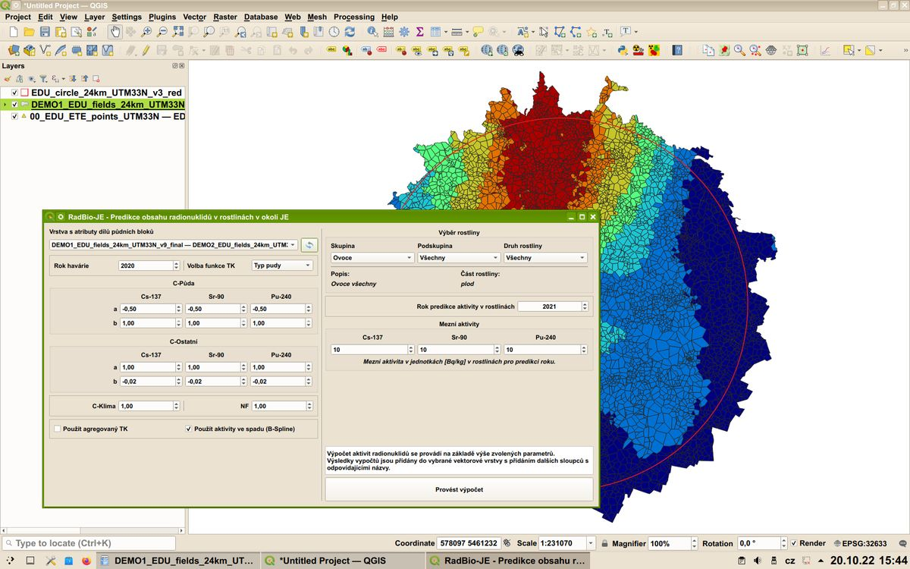

# RadBio - softwarový nástroj pro odhad kontaminace rostlinné  biomasy na území zasaženém jadernou havárií

*Po radiační havárii mohou být radionuklidy kontaminovány rozsáhlé plochy určené k zemědělské produkci, a tím velmi omezeny možnosti využívání krajiny. Obnovení zemědělské činnosti na zasaženém území proto bude jednou z hlavních priorit. K tomu by měl pomoci i vyvinutý software RadBio, umožňující odhadnout kontaminaci biomasy rostlin na základě informací o půdních charakteristikách a velikosti kontaminace půdy.*

Software RadBio je jedním z výsledků projektu výzkumu a vývoje "[Optimalizace postupů pro realizaci rostlinné výroby na území zasaženém jadernou havárií (VI20192022153)](https://starfos.tacr.cz/cs/project/VI20192022153)" řešeného v programu Bezpečnostní výzkum České republiky, jehož poskytovatelem je Ministerstvo vnitra České Republiky.

Řešiteli projektu jsou:

[Státní ústav radiační ochrany, v.v.i.](https://www.suro.cz/cz/vyzkum)

[Česká zemědělská univerzita v Praze / Fakulta životního prostředí](https://www.fzp.czu.cz/cs/r-6897-veda-a-vyzkum)

[ENKI, o.p.s.](https://www.enki.cz/cs/projekty)

[Jihočeská univerzita v Českých Budějovicích / Zemědělská fakulta](https://www.fzt.jcu.cz/cz/veda-a-vyzkum/vyzkumna-temata)

## Softwarové nástroje RadBio-ČR a RadBio-JE
- oba nástroje jsou multiplatformní, byly úspěšně provozovány v operačním systému MS Windows 10 a Kubuntu GNU/Linux, funkčnost v systému Apple MacOS nebylo možné otestovat

### RadBio-ČR

- standalone desktop aplikace s grafickým rozhraním, v jazyce Python (SW byl testován na OS Windows 10, Python 3.10 a Kubuntu GNU/Linux Kubuntu 20.04 LTS + Python 3.8)
- software vyžaduje knihovny PyQt5, matplotlib, pandas, openpyxl (dostupné prostřednictvím Pip instalátoru v rámci Pythonu)
- bez mapové vizualizace
- výstup formou grafu / tabulky, možnost exportu výsledků ve formátu MS Excel

### RadBio-JE 

- plugin pro desktop software QGIS (open-source, GNU-GPL)
- mapovou funkcionalitu poskytuje QGIS
- plugin se stará o specializované výpočty
- potřeba jsou mapové podklady se vstupními parametry (vektorové polygonové vrstvy s příslušnými atributy)

Software byl vytvořen ve spolupráci s Institutem radiobiologie, Gomel, Bělorusko.

Kód obou programů byl testován nástrojem Bandit, žádné nedostatky nebyly zjištěny.

