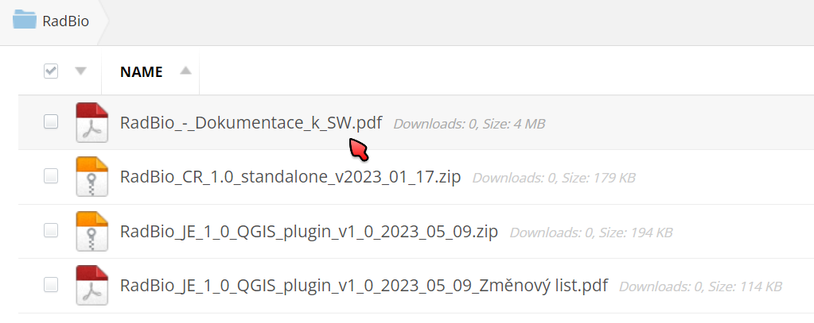
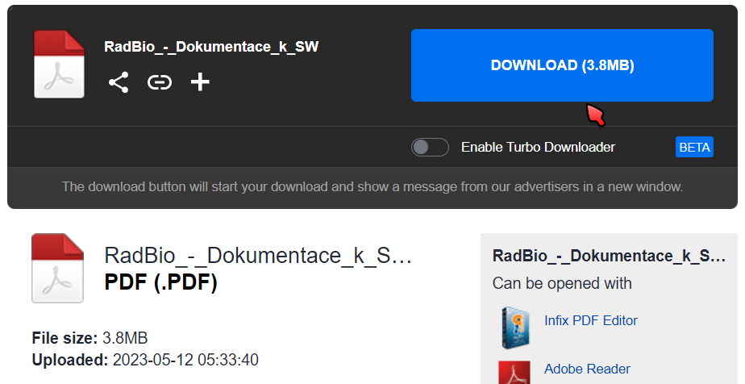

# RadBio - stažení software. dokumentace i demo dat

*V souladu s požadavkem poskytovatele projektu - Ministerstva vnitra České Republiky (dále jen MV) - musíme vést evidenci uživatelů software RadBio. Statistické vyhodnocení těchto informací bude využito v dokumentech poskytovaných MV, jména konkrétních osob ani emailové adresy nebudou součástí těchto vyhodnocení. Proto Vás prosíme před stažením software o vyplnění [**tohoto krátkého dotazníku**](https://forms.gle/WHuAGPF6k2S6qLFG6).*

*Děkujeme!*

**Stažení souborů:**

Všechny soubory jsou k dispozici ze sdílené složky na serveru MediaFire, kam se dostanete kliknutím [**na tento odkaz**](https://www.mediafire.com/folder/hjy3a6hgl4cwp/RadBio). 
Zobrazí se vám složka s výpisem souborů (stahovat lze pouze po jednom souboru):

Dokumenty jsou ke stažení přímo ve formě PDF, software je pak distribuován v ZIP archivech. RadBio-JE (SW pro okolí JE, QGIS plugin) se instaluje přímo ze ZIP souboru z QGISu, v případě 
RadBio-CR (SW pro celou ČR, samostatná aplikace) bude po stažení potřeba ZIP rozbalit. ZIP archivy nejsou chráněny heslem, lze je tedy bez problému otestovat antivirovými nástroji ještě před rozbalením / instalací. Podrobnější postup se dozvíte v návodech na instalaci zmíněných níže.

Kliknutím myší na konkrétní soubor jste přesměrování na stránku pro stažení - kliknutím na modré tlačítko Download stáhnete soubor:

**Návod k instalaci:**

[**RadBio-JE**  (SW pro okolí JE, QGIS plugin)](https://github.com/juhele/RadBio/tree/main/RadBio-JE)

[**RadBio-CR** (SW pro celou ČR, samostatná aplikace)](https://github.com/juhele/RadBio/tree/main/RadBio-CR)

